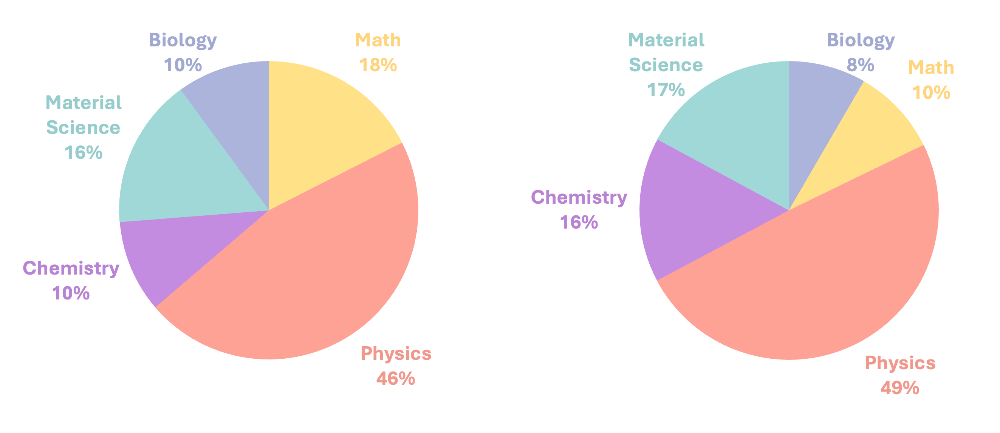
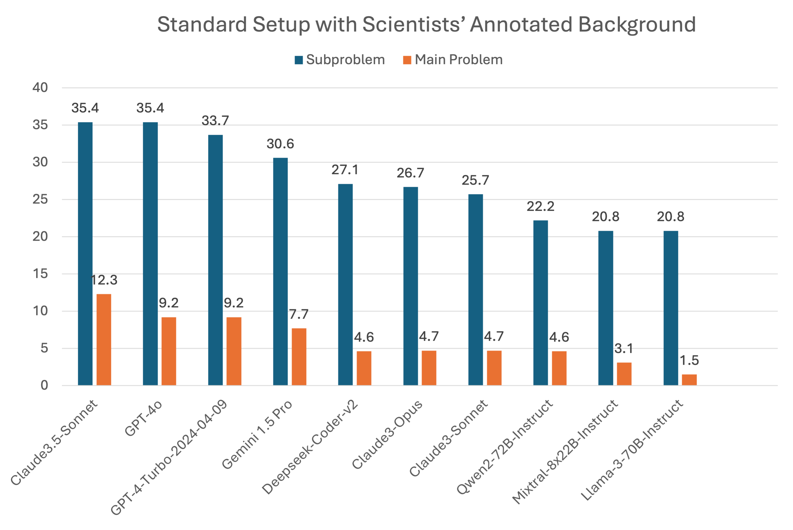
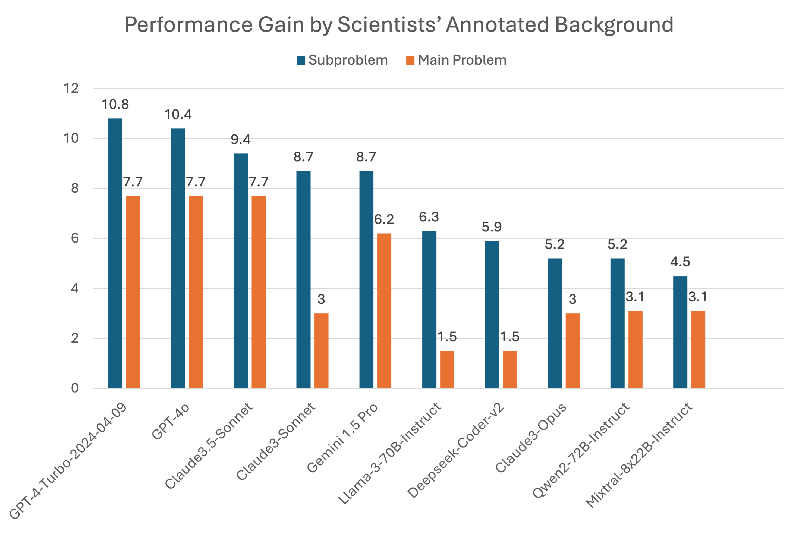

# SciCode: A Research Coding Benchmark Curated by Scientists

<strong>Minyang Tian1,2*‡, Luyu Gao3*, Shizhuo Dylan Zhang1, Xinan Chen1†, Cunwei Fan1†, Xuefei Guo1†, Roland Haas1†, Pan Ji4†, Kittithat Krongchon1†, Yao Li1†, Shengyan Liu1†, Di Luo5,6,11†, Yutao Ma7†, Hao Tong1†, Kha Trinh7†, Chenyu Tian8†, Zihan Wang1†, Bohao Wu1†, Yanyu Xiong9†, Shengzhu Yin1†, Minhui Zhu1†, Kilian Lieret10, Yanxin Lu1, Genglin Liu1, Yufeng Du1, Tianhua Tao1, Ofir Press10, Jamie Callan3, Eliu Huerta1,2,7‡, Hao Peng1‡</strong>

1University of Illinois Urbana-Champaign  
2Argonne National Laboratory  
3Carnegie Mellon University  
4University of North Carolina at Chapel Hill  
5Massachusetts Institute of Technology  
6Harvard University  
7University of Chicago  
8University of Texas at Austin  
9Stanford University  
10Princeton University  
11The NSF AI Institute for Artificial Intelligence and Fundamental Interactions  

* Equal contribution lead authors. † Data curation, alphabetical order.
‡ Corresponding to: {mtian8, haopeng}@illinois.edu, elihu@anl.gov

-   :material-book:{ .lg .middle } __Paper__

    ---

    Learn all the details

    [:octicons-arrow-right-24: Read the paper](https://arxiv.com)

-   :material-download:{ .lg .middle } __Dataset__

    ---

    Browse all the problems

    [:octicons-arrow-right-24: Download Dataset](https://raw.githubusercontent.com/scicode-bench/scicode-bench.github.io/main/data/problems_all.jsonl)

-   :material-github:{ .lg .middle } __Github Repo__

    ---

    Learn how to evaluate your model

    [:octicons-arrow-right-24: Installation & usage](https://github.com/scicode-bench/SciCode)

-   :material-trending-up:{ .lg .middle } __Leaderboard__

    ---

    How good are LMs at science, really?
    (Coming soon...)

    [:octicons-arrow-right-24: Browse the results](leaderboard.md)

    

## Introduction
SciCode is a challenging benchmark designed to evaluate the capabilities of language models (LMs) in generating code for solving realistic scientific research problems. It has a diverse coverage of **16** subdomains from **6** domains: Physics, Math, Material Science, Biology, and Chemistry. Unlike previous benchmarks that consist of exam-like question-answer pairs, SciCode is converted from real research problems. SciCode problems naturally factorize into multiple subproblems, each involving knowledge recall, reasoning, and code synthesis. In total, SciCode contains **338** subproblems decomposed from **80** challenging main problems, and it offers optional descriptions specifying useful scientific background information and scientist-annotated gold-standard solutions and test cases for evaluation. Claude3.5-Sonnet, the best-performing model among those tested, can solve only **4.6%** of the problems in the most realistic setting. Broadly, SciCode demonstrates a realistic and scientists' everyday workflow of identifying critical science concepts and facts and then transforming them into computation and simulation code. We believe SciCode not only helps demonstrate contemporary LLMs' progress towards helpful assistant for scientists but also helps shed light on future building and evaluation of scientific AI.

## Overview
SciCode sources challenging and realistic research-level coding problems across 6 natural science disciplines, covering a total of 16 subfields. This diverse selection ensures a comprehensive representation of the natural sciences, where extensive code development is essential. SciCode is mainly drawn from the scripts that scientists use in their everyday workflow. Many of these have been used in one or more publications, demonstrating their robustness and correctness.

Among various coding necessities, Scicode mainly focuses on 1. Numerical methods 2.Simulation of systems 3. Scientific calculation. These are the tasks we believe require intense scientific knowledge and reasoning to optimally test LM’s science capability. The below figure is an example of the combination of 1 and 3.

In designing test cases for evaluation, we incorporate domain-specific test cases in addition to numerical cases. These tests are extracted from real scientific workflows: scientists must design domain-specific test cases to verify code accuracy by reproducing results published in papers or matching analytical solutions derived from theoretical models. Each problem goes through **3** rounds of validation (i.e. by in-domain scientists, out-of-domain scientists, GPT4) for quality control.

## Benchmark Statistics

| **Fields**           | **Subfields**                                                                                                 |
|----------------------|---------------------------------------------------------------------------------------------------------------|
| **Mathematics**      | [Numerical Linear Algebra](problems.md#numerical-linear-algebra) (8), [Computational Mechanics](problems.md#computational-mechanics) (5), [Computational Finance](problems.md#computational-finance) (1) |
| **Physics**          | [Condensed Matter Physics](problems.md#condensed-matter-physics) (13), [Optics](problems.md#optics) (10), [Quantum Information/Computing](problems.md#quantum-informationcomputing) (6), [Computational Physics](problems.md#computational-physics) (5), [Astrophysics](problems.md#astrophysics) (2), [Particle Physics](problems.md#particle-physics) (1) |
| **Chemistry**        | [Quantum Chemistry](problems.md#quantum-chemistry) (5), [Computational Chemistry](problems.md#computational-chemistry) (3)          |
| **Biology**          | [Ecology](problems.md#ecology) (6), [Biochemistry](problems.md#biochemistry) (1), [Genetics](problems.md#genetics) (1)                         |
| **Material Science** | [Semiconductor Materials](problems.md#semiconductor-materials) (7), [Molecular Modeling](problems.md#molecular-modeling) (6)       |

Left: Distribution of Main Problems   Right: Distribution of Subproblems

## Experiment Results
We evaluate our model using zero-shot prompts. We keep the prompts general and design different ones for different evaluation setups only to inform the model about the tasks. We keep prompts the same across models and fields, and they contain the model’s main and sub-problem instructions and code for previous subproblems. The standard setup means the model is tested without background knowledge and carrying over generated solutions to previous subproblems. The scientists' annotated background provides the necessary knowledge and reasoning steps to solve the problems, shifting the evaluation’s focus more towards the models’ coding and instruction-following capabilities.

